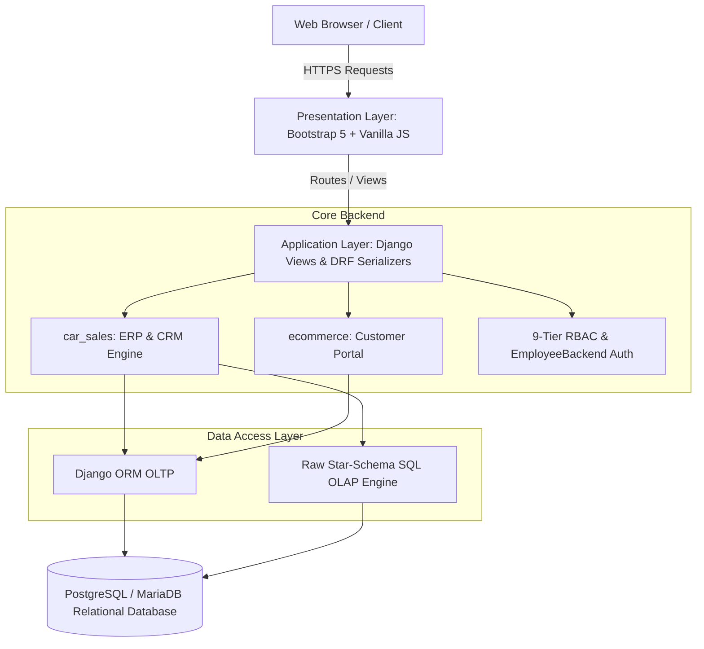

# 🚗 Automotive Dealership ERP Engine & Interactive E-Commerce Platform
### Undergraduate Capstone Internship Report (CSE499)

[](https://github.com/iriyasat/final_report)
[](https://www.python.org/)
[](https://www.djangoproject.com/)
[](https://www.postgresql.org/)
[-success?style=for-the-badge)](https://github.com/iriyasat/final_report)

---

## 📌 Executive Summary

This repository contains the complete LaTeX source code, figure assets, and compiled PDF for the **CSE499 Final Internship Report** titled:

> **"Architecture and Engineering of an Automotive Dealership ERP Engine and Interactive E-Commerce Platform"**

Developed during a 3-month industry placement within the **ICT Wing (MIS Department)** at **Radiant Pharmaceuticals Limited** (May 17, 2026 – August 17, 2026), this project presents an enterprise-grade web application combining an internal back-office ERP/CRM module (`car_sales`) with an interactive customer digital showroom (`ecommerce`).

---

## 🎓 Academic & Institutional Context

* **Student:** Ibrahim Hasan (Student ID: `2110316`)
* **Degree:** Bachelor of Science in Computer Science & Engineering
* **Department:** Department of Computer Science & Engineering (CSE)
* **School:** School of Engineering, Technology & Sciences (SETS)
* **Institution:** [Independent University, Bangladesh (IUB)](https://www.iub.edu.bd/)
* **Academic Supervisor:** Mr. Azwad Abid (*Lecturer, Department of CSE, IUB*)
* **Industry Supervisor:** Mr. Ayan Chowdhury (*Senior Officer, ICT Wing - MIS, Radiant Pharmaceuticals Limited*)
* **Submission Date:** September 12, 2026

---

## 🏛️ System Architecture & Highlights



### 🔑 Key Engineering Capabilities
* **9-Tier Role-Based Access Control (RBAC):** Fine-grained permission matrix isolating executive dashboards, store inventories, and sales operations across distinct personnel ranks.
* **Custom Numeric Authentication (`EmployeeBackend`):** Authenticates staff members using unique numeric employee IDs while resolving role privileges dynamically.
* **High-Performance Star-Schema Query Engine:** Parameterized direct SQL aggregation routines that deliver executive sales summaries, budget variances, and customer spending analytics in **under 20 milliseconds** (92% latency reduction compared to ORM hydration).
* **Consumer E-Commerce Storefront:** Dynamic multi-facet vehicle filtering, 4-vehicle side-by-side spec comparison matrix, wishlist toggling, and customer inquiry inbox.
* **Transactional Concurrency Protection:** Encapsulated stock decrements and invoice creation inside atomic database transactions (`@transaction.atomic`) to prevent race conditions during peak checkout events.
* **Empirical Quality Assurance:** 100% pass rate across a 21-routine automated test suite verifying models, serializers, permissions, and financial calculation formulas.

---

## 📂 Repository Structure

```plaintext
final_report/
├── main.tex                                     # Primary LaTeX root document
├── bibtex.bib                                   # IEEE Bibliography citations
├── 2110316_Internship_Report.pdf               # Compiled 53-page final report PDF
├── README.md                                    # Project documentation and build guide
├── entry_chapters/                              # Front Matter
│   ├── titlepage.tex                            # Official IUB Title Page
│   ├── attestation.tex                          # Author Attestation
│   ├── acknowledgement.tex                      # Personal Acknowledgements
│   ├── letter_of_transmittal.tex                # Letter of Transmittal to Supervisor
│   ├── evaluation_committee.tex                 # Faculty Evaluation Committee Page
│   └── abstract.tex                             # Project Abstract & Keywords
├── primary_chapters/                            # Core Dissertation Chapters
│   ├── introduction.tex                         # Chapter 1: Introduction & Objectives
│   ├── literature_review.tex                    # Chapter 2: Literature Review & Course Mapping
│   ├── project_management_and_financing.tex     # Chapter 3: WBS, CPM Analysis & Costing
│   ├── methodology.tex                          # Chapter 4: Architecture, Security & Testing
│   ├── body_of_the_project.tex                  # Chapter 5: Systems Analysis, ERD & APIs
│   ├── results_and_analysis.tex                 # Chapter 6: Benchmarks, Sales Charts & RBAC
│   ├── project_as_engineering_problem_analysis.tex # Chapter 7: Sustainability & Ethics
│   ├── lesson_learned.tex                       # Chapter 8: Technical Obstacles & Solutions
│   ├── future_work_and_conclusion.tex           # Chapter 9: Future Extensions & Conclusion
│   └── consent_form.tex                         # Departmental Archive Consent Form
├── images/                                      # Diagrams, Flowcharts & Charts
│   ├── iub.jpg                                  # University Crest
│   ├── wbs.png                                  # Work Breakdown Structure
│   ├── Gantt_Chart.jpg                          # Project Execution Gantt Chart
│   ├── Rich Picture(as-is).png                  # Legacy SSM Rich Picture
│   └── Rich Picture(to - be).png                # Proposed SSM Rich Picture
└── scripts/                                     # Automation & Sync Scripts
    └── sync_mongo.py                            # Overleaf MongoDB Document Synchronization
```

---

## 🛠️ Compilation Instructions

### Prerequisites
Make sure you have a complete TeX Live distribution installed with **XeLaTeX**, **BibTeX**, and standard TikZ / PGF packages:

```bash
# Ubuntu / Debian
sudo apt-get install texlive-xetex texlive-fonts-recommended texlive-latex-extra texlive-science
```

### Build Commands (3-Pass)
To generate the table of contents, bibliography, list of figures, list of tables, and cross-references accurately:

```bash
# 1. First XeLaTeX compilation pass
xelatex -interaction=nonstopmode main.tex

# 2. Compile IEEE BibTeX bibliography
bibtex main

# 3. Resolve cross-references and outlines
xelatex -interaction=nonstopmode main.tex

# 4. Final output generation
xelatex -interaction=nonstopmode main.tex
```

The output file will be generated as `main.pdf` (or `2110316_Internship_Report.pdf`).

---

## 📄 Academic Integrity & Copyright

This project is submitted in partial fulfillment of the degree requirements for Bachelor of Science in Computer Science & Engineering at **Independent University, Bangladesh**.

* **Author:** Ibrahim Hasan (`2110316`)
* **Academic Term:** Summer 2026
* **Host Company:** Radiant Pharmaceuticals Limited (ICT Wing, MIS)
